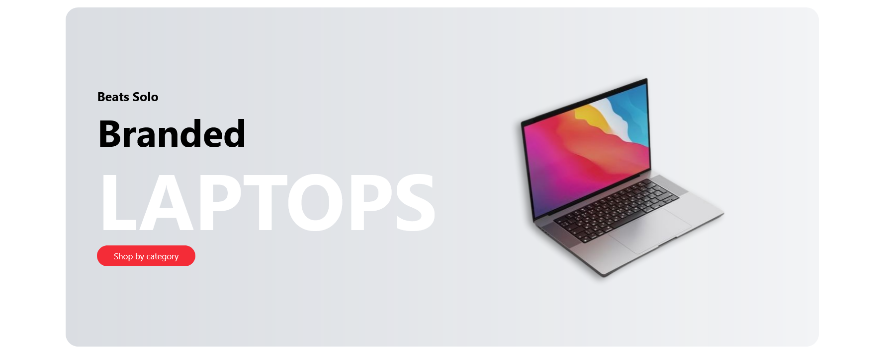
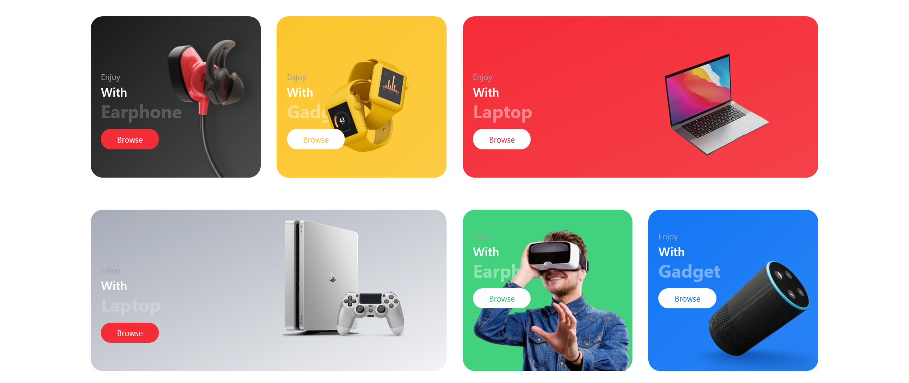
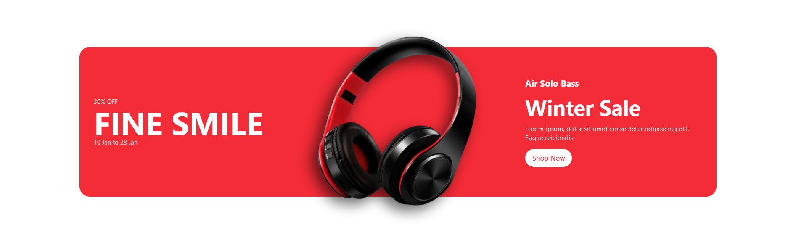
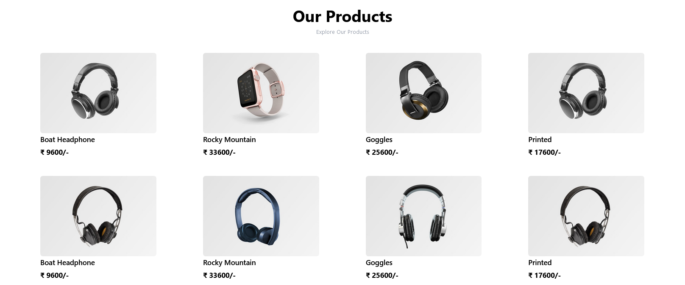
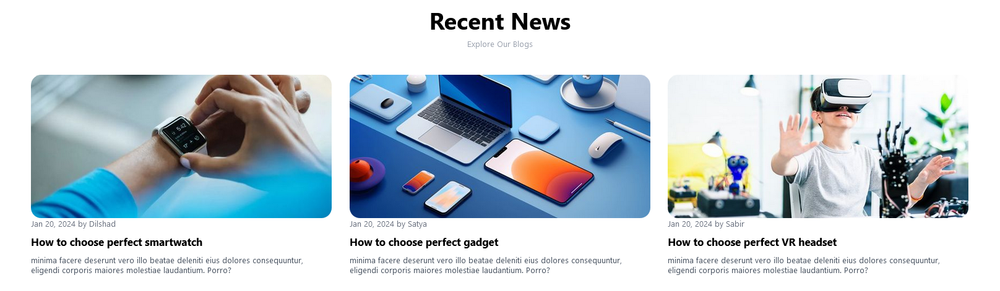

# V2 E-COM
This is a fully responsive e-commerce landing page designed using HTML5, CSS3, Tailwind CSS and React. It is a simple and clean design that can be used as a starting point for building an e-commerce website. The landing page is designed to be responsive, which means it will look great on any device, including desktops, laptops, tablets, and smartphones.

[Visit Now](https://electronics-tailwind.vercel.app/) 🚀

## Technologies Used 
 

## Features
- Fully responsive design that looks great on all devices
- Clean and modern UI with a focus on simplicity
- Dark mode feature
- Easy to use and customize
- Compatible with all modern browsers

## NPM Packages Used
- react-slick (for carousel)
- aos (for animation)
- react-icons

## Screenshots
Here are some of the Screenshots of V2 E-COM 
### 1. Hero Section

### 2. Latest Products Section

### 3. Banner Section

### 4. Prodcuts Section

### 5. News Section

Happy Coding🙂